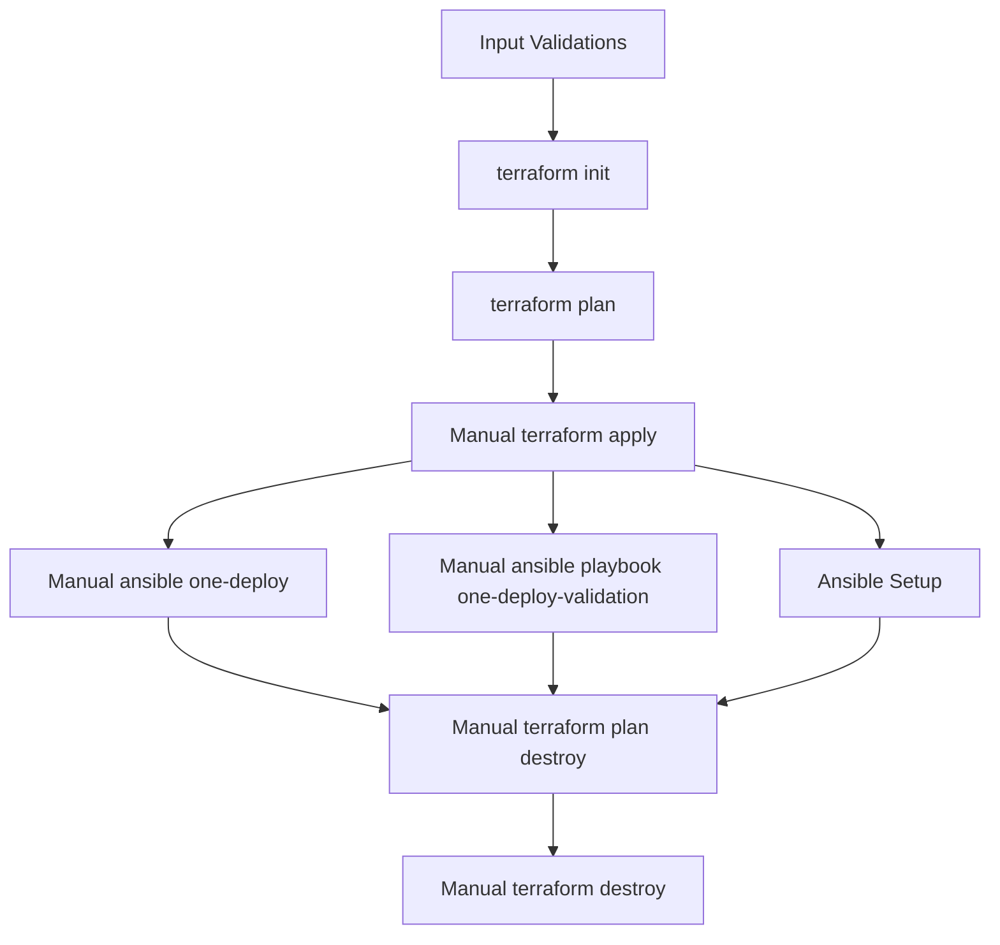

  

# Deployment Guide

## 🏗️ Target OpenNebula Architecture

This section provides a detailed description of the target architecture based on OpenNebula, specifically deployed on Scaleway Elastic Metal instances. The architecture is designed to leverage the robust capabilities of bare-metal servers to deliver a comprehensive Infrastructure-as-a-Service (IaaS) solution.

### Objectives

The primary objective is to deliver a full-fledged IaaS infrastructure on bare-metal servers, ensuring high performance, reliability, and scalability.

### Core Components

**OpenNebula Front-end (with KVM):**

- **Functionality:** Manages the entire lifecycle of virtual machines (VMs), including networking and storage. It also provides the OpenNebula frontend interface for user interaction.
- **Additional Role:** Runs local virtual machines, effectively acting as a compute node within the infrastructure.

**Hypervisor Nodes:**

- **Instance Type:** EM-A610R-NVMe instances running KVM.
- **Networking:** Connected to a private network for secure internal communication.
- **Public Access:** Can be attached to a Public IP to provide external access to VMs.

### Storage

- **Local Storage:** Each node is equipped with local NVMe SSDs to ensure high-speed data access and storage performance.
- **Capacity:** 2× NVMe 960 GB local storage per node, providing ample space for VM images and data.

### Networking

- **Virtual Network:** Utilizes Private Networks within a Virtual Private Cloud (VPC) to ensure secure and isolated communication between instances.
- **Public Gateway:** For high traffic scenarios, a Public Gateway is the preferred method. However, for initial deployment and Minimum Viable Product (MVP) phases, Public IPs can be directly attached to instances via Network Interface Cards (NIC).


### High-Level Diagram

The high-level diagram below illustrates the overall architecture, including the interaction between the OpenNebula Front-end, hypervisor nodes, and networking components.


### Hardware Specification

The hardware specifications for the Elastic Metal Instances – EM-A610R-NVMe are as follows:

| Role | Instance Type | CPU | RAM | Disks | KVM | Count | Bandwidth |
|------|---------------|-----|-----|-------|-----|-------|-----------|
| Front-end + KVM | EM-A610R-NVMe | AMD Ryzen PRO 3600 (6C / 12T) | 16 GB | 2× NVMe 960 GB | Yes | 1 | Up to 1 Gbps |
| Hypervisor(s) | EM-A610R-NVMe | AMD Ryzen PRO 3600 (6C / 12T) | 16 GB | 2× NVMe 960 GB | Yes | 1 to any | Up to 1 Gbps |

This setup ensures that the infrastructure is capable of handling a wide range of workloads, providing both the computational power and storage capacity necessary for demanding applications.

### Provisioning Strategies

#### Prerequisites and Capabilities

**Prerequisites:**
- Ubuntu 22.04 or 24.04 with Netplan version 0.105 or higher.
- Passwordless SSH login as root from the Front-end node to the Hypervisor nodes.
- The user performing the installation must have the ability to sudo to the root account.
- A range of free IP addresses available on the same network connecting the Front-end and Hypervisors.

**Capabilities:**
- Utilization of OneDeploy roles and tags.
- Integration of the OneHook driver in Ansible.

Got it! Here’s the **final version of the `deployment_guide.md` in English**, merging your current deployment structure, `.secret.skel` variables, original repository instructions, and OpenNebula feedback adjustments:

---

# Deployment Guide for Scaleway Hosted Cloud with OpenNebula

## 1. Prerequisites

* OpenTofu >= v1.5.0
* Scaleway API credentials
* OpenNebula CLI tools (optional)
* Ansible

---

# Requirements

1. Install `hatch`

   ```shell
   pip install hatch
   ```

## 2. Repository Setup

### Clone the Repository

```bash
git clone https://github.com/OpenNebula/hosted-cloud-scaleway.git
cd hosted-cloud-scaleway
```

### Initialize Submodules

```bash
git submodule update --init --remote --merge
```

### Install Ansible Collections

```bash
make submodule-requirements
```

---

## 3. Initialize Secrets File

Copy the skeleton secrets file and configure environment variables:

```bash
cp .secret.skel .secret
```

Edit `.secret` and populate:

```bash
export TF_VAR_customer_name='opennebula'
export TF_VAR_project_name='opennebula-scw'

export SCW_ACCESS_KEY='<Your Scaleway Access Key>'
export SCW_SECRET_KEY='<Your Scaleway Secret Key>'

export AWS_ACCESS_KEY_ID=$SCW_ACCESS_KEY
export AWS_SECRET_ACCESS_KEY=$SCW_SECRET_KEY

export SCW_DEFAULT_ORGANIZATION_ID='<Your Scaleway Organization ID>'
export SCW_DEFAULT_REGION='fr-par'
export SCW_DEFAULT_ZONE='fr-par-2'

export TF_VAR_state_infrastructure_information='{ scw_infrastructure_project_name = "string" }'
export TF_VAR_region=$SCW_DEFAULT_REGION
export TF_VAR_zone=$SCW_DEFAULT_ZONE
export TF_VAR_tfstate='any-state-name-tfstates'
export TF_VAR_project_fullname='projectname-scw-infra'
export TF_VAR_private_subnet="10.16.0.0/20"
export TF_VAR_worker_count="1"
```

Source the file:

```bash
source .secret
```

> **Note:** `.secret` is in `.gitignore` and **must never be committed**.

---

## 4. Infrastructure Deployment (Tofu Modules)

The infrastructure is organized into modular directories that must be applied sequentially:

### Module Execution Order:

1. `001.terraform_state_management`
2. `002.vpc`
3. `003.opennebula_instances`
4. `004.opennebula_inventories`

### Execute Each Module:

```bash
cd <module_directory>
tofu init
tofu plan
tofu apply
cd ..
```

#### Example:

```bash
cd 001.terraform_state_management/
tofu init
tofu apply
cd ..
```

Repeat for all modules in order.
---

## 5. Inventory Validation (Ansible)

** Needs module 004 to be applied ** 

Test connectivity to the provisioned hosts using:

```bash
ansible -i inventory/scaleway.yml all -m ping -b
```

Expected result:

```json
fe | SUCCESS => { "changed": false, "ping": "pong" }
host01 | SUCCESS => { "changed": false, "ping": "pong" }
```

Ensure:

* SSH key path is correctly defined in `inventory/group_vars/all.yml`:

  ```yaml
  ansible_ssh_private_key_file: scw/003.opennebula_instances/opennebula.pem
  ```
* Hosts are accurately defined in `inventory/scaleway.yml`.

---

## 6. OpenNebula Post Installation

If you need to SSH into the frontend server:

```bash
ssh -i scw/003.opennebula_instances/opennebula.pem ubuntu@<frontend-server-ip>
```

1. Deploy OpenNebula:

   ```shell
   make deployment
   ```

2. Configure the deployment for the specifics of the Cloud Provider:

   ```shell
   make specifics
   ```

3. Test the deployment:

   ```shell
   make validation
   ```

---
## 7. CI/CD Pipeline (WIP)

A GitHub Actions CI/CD pipeline is planned to:

* Automate bare-metal provisioning.
* Deploy OpenNebula.
* Handle post-deployment configurations.

> For now, CI/CD is a **Work In Progress (WIP)** and is not required for the minimal viable deployment.

---

## 8. User Workflow Summary

After completing the infrastructure deployment:

* Users will access OpenNebula (via Sunstone UI or CLI).
* Manage Scaleway bare-metal servers.
* Orchestrate VMs and networking within OpenNebula.

---

## 9. Known Limitations

* CI/CD pipeline is pending.

---

This guide reflects the current Scaleway integration and will be updated as CI/CD pipelines and automation workflows are developed.

---

Shall I now draft the **email/message to OpenNebula’s Engineering Team** to summarize these changes and provide them this updated guide?


##### Optional CI/CD

Given that sensitive tokens are often required to set up an environment, we can create a CI/CD pipeline where user inputs are defined as sensitive variables. This approach ensures secure handling of critical information. The CI/CD pipeline would prompt for the following sensitive inputs:

- Scaleway token (scw token)
- CIDR blocks
- Host IP addresses

The CI/CD pipeline can then validate these IP addresses against the provided CIDR blocks. This setup allows for a seamless and effortless environment configuration to deploy this module. Below are the steps involved in the CI/CD pipeline:

1. **Input Validations:** Ensure all provided inputs are valid and correctly formatted.
2. **Terraform Initialization:** Execute `terraform init` to initialize the Terraform configuration.
3. **Terraform Plan:** Run `terraform plan` to create an execution plan (this step depends on the successful completion of `terraform init`).
4. **Manual Terraform Apply:** Manually trigger `terraform apply` to apply the changes required to reach the desired state (this step depends on the successful completion of `terraform plan`).
5. **Ansible Setup:** Configure Ansible for deployment (this step depends on the successful completion of `terraform apply`).
6. **Manual Ansible Playbook Validation:** Manually trigger the Ansible playbook `one-deploy-validation` to validate the deployment (this step depends on the successful completion of `terraform apply`).
7. **Manual Ansible Deployment:** Manually trigger the Ansible playbook `one-deploy` to execute the deployment (this step depends on the successful completion of `terraform apply`).
8. **Manual Terraform Plan for Destroy:** Manually trigger `terraform plan -destroy` to create a plan to destroy the infrastructure (this step depends on the successful completion of `terraform apply`).
9. **Manual Terraform Destroy:** Manually trigger `terraform destroy` to destroy the infrastructure (this step depends on the successful completion of `terraform plan -destroy`).

Here is a simple Mermaid diagram illustrating the CI/CD steps:



This diagram provides a visual representation of the CI/CD pipeline steps and their dependencies.


