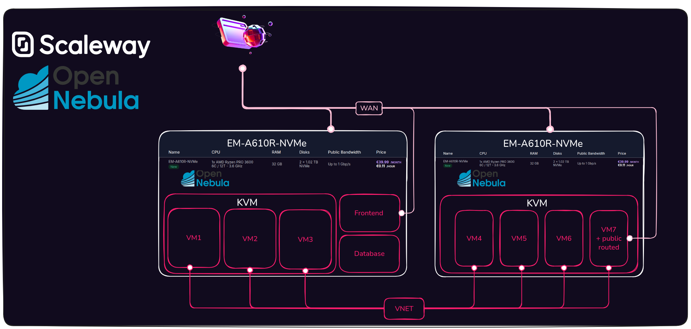
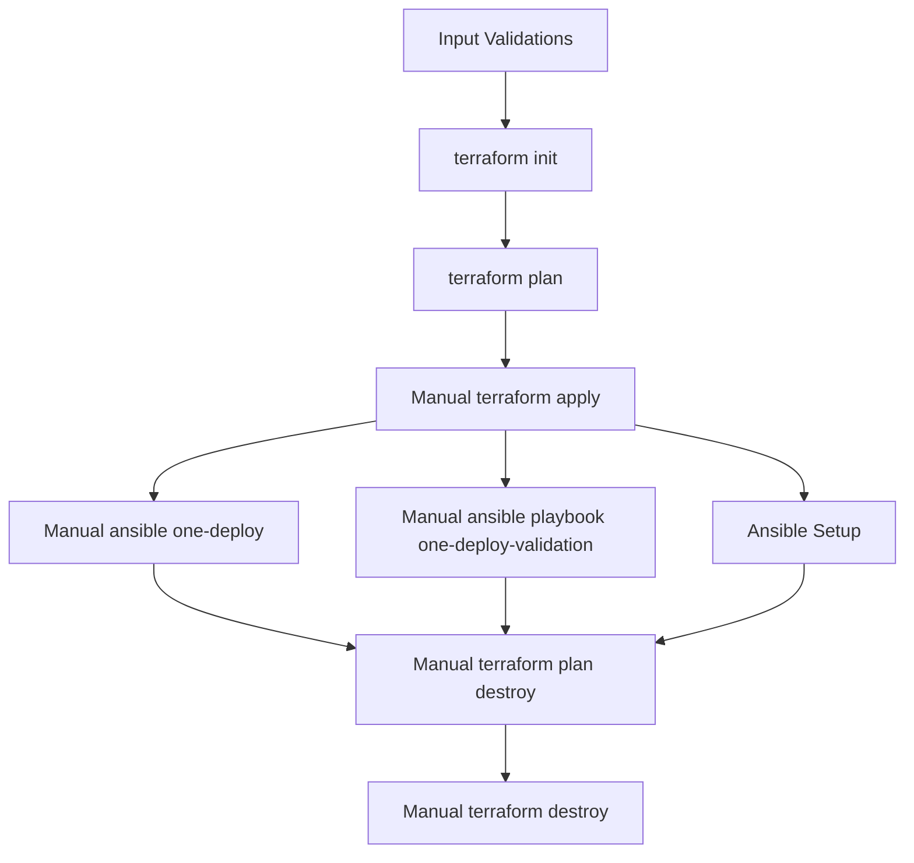

  

# Deployment Guide

## Table of Contents

- [1. Scaleway Hosted Cloud Overview](#1-scaleway-hosted-cloud-overview)
- [2. Requirements](#2-requirements)
- [3. Repository Setup](#3-repository-setup)
- [4. Secrets and Environment Variables](#4-secrets-and-environment-variables)
- [5. Infrastructure Provisioning (OpenTofu Modules)](#5-infrastructure-provisioning-opentofu-modules)
- [6. Inventory and Parameter Management](#6-inventory-and-parameter-management)
- [7. Networking Configuration](#7-networking-configuration)
- [8. OpenNebula Deployment Workflow](#8-opennebula-deployment-workflow)
- [9. Validation Suite](#9-validation-suite)
- [10. Troubleshooting & Known Issues](#10-troubleshooting--known-issues)
- [11. CI/CD Roadmap](#11-cicd-roadmap)
- [12. Extending the Cloud](#12-extending-the-cloud)

## 1. Scaleway Hosted Cloud Overview

This repository delivers the Terraform, Ansible, and driver customizations required to build an OpenNebula Hosted Cloud on **Scaleway Elastic Metal**. It extends the upstream [`one-deploy`](https://github.com/OpenNebula/one-deploy) and [`one-deploy-validation`](https://github.com/OpenNebula/one-deploy-validation) projects via git submodules and adds Scaleway-specific infrastructure modules, inventories, and Flexible IP (FIP) drivers.

### Objectives

Deploy a full-featured IaaS environment on bare-metal servers with deterministic networking, managed inventories, and reusable automation so that OpenNebula can be repeatedly installed, validated, and extended on Scaleway.

### Core Components

**OpenNebula Front-end (with KVM):**

- Manages the entire lifecycle of virtual machines (VMs) and doubles as a compute node.
- Provides the OpenNebula CLI/API and Sunstone UI for operators.

**Hypervisor Nodes:**

- EM-A610R-NVMe instances running KVM and attached to the same private network as the frontend.
- Can receive public connectivity via Flexible IPs (FIPs) or a Public Gateway.

`roles/one-driver` ships a custom VNM bridge hook that attaches and detaches FIPs through the Scaleway APIs. Commits `967216f`, `4399aed`, and `a165376` added multi-NIC support and improved cleanup and logging under `/var/log/vnm`.

### Storage

- 2× NVMe 960 GB drives per node provide high IOPS local storage for VM images and context disks.

### Networking

- Private connectivity is delivered through a VPC/VLAN mesh created by the Terraform modules under `scw/`.
- Public access can attach directly to instances in the MVP phase or via a Public Gateway for higher-scale deployments.
- The default netplan layout creates `br0` for public/FIP traffic, `brvmtovm` for host-to-host VXLAN, and VLAN-tagged subinterfaces for tenant networks.


### High-Level Diagram



### Hardware Specification

| Role | Instance Type | CPU | RAM | Disks | KVM | Count | Bandwidth |
|------|---------------|-----|-----|-------|-----|-------|-----------|
| Front-end + KVM | EM-A610R-NVMe | AMD Ryzen PRO 3600 (6C / 12T) | 16 GB | 2× NVMe 960 GB | Yes | 1 | Up to 1 Gbps |
| Hypervisor(s) | EM-A610R-NVMe | AMD Ryzen PRO 3600 (6C / 12T) | 16 GB | 2× NVMe 960 GB | Yes | 1..N | Up to 1 Gbps |

### Provisioning Strategies

**Prerequisites**

- Ubuntu 22.04 or 24.04 with Netplan ≥ 0.105 on provisioned nodes.
- Password-less SSH from the frontend to hypervisors.
- Ability to sudo to root on all nodes.
- A pool of free IP addresses on the management network.

**Capabilities**

- Utilization of OneDeploy roles/tags and the OneHook driver.
- Automated inventories rendered from Terraform outputs.
- Re-runnable Ansible plays to keep hooks and packages up to date.

## 2. Requirements

| Component | Version / Notes |
|-----------|-----------------|
| OpenTofu  | ≥ 1.5.0 (used by the `scw/*` modules) |
| Python / pip | Needed for [hatch](https://hatch.pypa.io) and Ansible tooling |
| Hatch     | Manages the `scaleway-default` execution environment |
| Ansible   | Driven via the Makefile targets |
| Scaleway Credentials | API access key, secret key, organization/project IDs |

Manual prerequisites (before automation):

- Create a Scaleway project (Console: Account > Projects) and an API key with `ElasticMetalFullAccess` + `IPAMFullAccess` (Console: IAM > API Keys). No bare-metal server needs to be pre-created—the Terraform modules provision the Elastic Metal servers and also create the Flexible IP IAM application/token automatically in module `005`.

Install the local tooling:

```bash
pip install hatch
make submodule-requirements     # installs Ansible collection deps
```

## 3. Repository Setup

```bash
git clone https://github.com/OpenNebula/hosted-cloud-scaleway.git
cd hosted-cloud-scaleway
git submodule update --init --remote --merge
```

The Makefile shortcuts (`deployment`, `validation`, `specifics`, `submodule-requirements`) proxy into the submodules with the Scaleway inventories pre-selected. Run commands from the repo root so relative paths (for keys, inventories, etc.) resolve correctly.

## 4. Secrets and Environment Variables

1. Copy the template and populate credentials:

   ```bash
   cp .secret.skel .secret
   ```

2. Edit `.secret` with the Terraform (`TF_VAR_*`) values, Scaleway credentials (`SCW_*`), AWS-compatible aliases (used by OpenTofu backends), and OpenNebula password. Create an **Admin-level** API key in the Scaleway Console at **IAM > API Keys** (covers the needed ElasticMetal + IPAM permissions). The Flexible IP IAM application/token is created automatically by module `005` and injected into the generated inventory; you do **not** need to pre-create or store this token. `SCW_DEFAULT_PROJECT_ID` is optional (not used by the modules).

3. Source the file before running any `tofu` or `make` commands:

   ```bash
   source .secret
   ```

Key inputs:

- `TF_VAR_customer_name`, `TF_VAR_project_name`, `TF_VAR_project_fullname` for resource naming.
- `TF_VAR_state_infrastructure_information` — object with `scw_infrastructure_project_name` (used to name the dedicated state project); `TF_VAR_tfstate` — bucket prefix for remote state. These two must be set or `tofu plan` will prompt for them.
- `TF_VAR_private_subnet`, `TF_VAR_vmtovm_subnet`, `TF_VAR_worker_count`, and netplan-related CIDRs consumed by `scw/003` and `scw/004`.
- `SCW_ACCESS_KEY`, `SCW_SECRET_KEY`, `SCW_DEFAULT_ORGANIZATION_ID`, `SCW_DEFAULT_REGION`, `SCW_DEFAULT_ZONE`. `SCW_DEFAULT_PROJECT_ID` is optional (not used by the modules).
- `TF_VAR_scw_secret_key` (often set to `$SCW_SECRET_KEY`) and AWS-compatible aliases (`AWS_ACCESS_KEY_ID`, `AWS_SECRET_ACCESS_KEY`) for the backend.
- `scw_flexible_ip_*` defaults referenced by `roles/one-driver/defaults/main.yaml` (populated by module `005`).

> `.secret` is ignored by git; never commit credential material.

## 5. Infrastructure Provisioning (OpenTofu Modules)

Modules live under `scw/` and must be executed sequentially with OpenTofu (or Terraform). Each directory contains its own state and variables.

| Order | Module | Purpose |
|-------|--------|---------|
| 001 | `terraform_state_management` | Bootstrap state bucket/project metadata |
| 002 | `vpc` | Create the VPC, VLANs, and subnet layout |
| 003 | `opennebula_instances` | Provision the frontend and KVM nodes + cloud-init assets |
| 004 | `opennebula_instances_net` | Configure netplan, VLAN tags, and Ethernet aliases |
| 005 | `opennebula_inventories` | Render `inventory/scaleway.yml` and helper artifacts |

Run each module in order after `source .secret` (keep them separate to ease debugging):

```bash
cd scw/001.terraform_state_management && tofu init && tofu plan -input=false && tofu apply && cd ../..
cd scw/002.vpc                      && tofu init && tofu plan -input=false && tofu apply && cd ../..
cd scw/003.opennebula_instances     && tofu init && tofu plan -input=false && tofu apply && cd ../..
cd scw/004.opennebula_instances_net && tofu init && tofu plan -input=false && tofu apply && cd ../..
cd scw/005.opennebula_inventories   && tofu init && tofu plan -input=false && tofu apply && cd ../..
```

Notes:

- If `tofu plan` prompts for `state_infrastructure_information` or `tfstate`, the environment variables `TF_VAR_state_infrastructure_information` and `TF_VAR_tfstate` were not exported (fill them in `.secret` and re-source it). Using `-input=false` surfaces the missing names immediately.
- No bare-metal resources are required beforehand—the modules above create the Elastic Metal servers, networking, inventories, and the Flexible IP IAM application/token for you. The generated token is written into `inventory/scaleway.yml` as `scw_flexible_ip_token`.

Review `deployment_guide.md#7-networking-configuration` for the expected netplan outputs and `deployment_guide.md#6-inventory-and-parameter-management` for generated files.

## 6. Inventory and Parameter Management

`inventory/scaleway.yml` is auto-generated by module `005` but can be edited for PoCs. Supplementary values live in `inventory/group_vars/all.yml`.

| Description | Variable(s) | Files / Templates |
|-------------|-------------|-------------------|
| SSH user and key path | `ansible_user`, `ansible_ssh_private_key_file` | `inventory/group_vars/all.yml` |
| Frontend + node metadata | `frontend.hosts.*`, `node.hosts.*` | `inventory/scaleway.yml` |
| Scaleway project/FIP identifiers | `scw_project_id`, `scw_server_id`, `scw_flexible_ip_token`, `scw_flexible_ip_zone` | `inventory/scaleway.yml`, `roles/one-driver/defaults/main.yaml` |
| OpenNebula credentials | `one_pass`, `one_version` | `inventory/scaleway.yml`, `.secret` |
| VNM templates | `vn.pubridge.template.*`, `vn.vxlan.template.*` | `inventory/scaleway.yml` |
| Validation knobs | `validation.*` | `inventory/group_vars/all.yml` |

Verify reachability once Terraform module `005` completes:

```bash
ansible -i inventory/scaleway.yml all -m ping -b
```

Successful output resembles:

```json
fe | SUCCESS => { "changed": false, "ping": "pong" }
host01 | SUCCESS => { "changed": false, "ping": "pong" }
```

Ensure the SSH key path (default `scw/003.opennebula_instances/opennebula.pem`) and hostnames match what Terraform produced.

## 7. Networking Configuration

- Cloud-init templates under `scw/004.opennebula_instances_net/template/` apply deterministic interfaces: `br0` (public/FIP), `brvmtovm` (VXLAN), and VLAN-tagged subinterfaces for tenant networks.
- `cloud_init_custom.tmpl` wires in OpenTofu outputs (`base_public_ip`, `gateway`, VLAN assignments, IPAM ranges) and assumes the bare-metal NIC is `enp5s0`.
- `roles/one-driver/templates/vnm/bridge/{pre,clean}.d` hooks bring Flexible IPs online/offline and log to `/var/log/vnm`.
- After provisioning, run an Ansible ping and, if needed, re-apply module `004` whenever netplan drift occurs.

## 8. OpenNebula Deployment Workflow

1. Review the submodules (`submodule-one-deploy`, `submodule-one-deploy-validation`) and local overrides (`playbooks/scaleway.yml`, `roles/one-driver`).
2. Deploy the base OpenNebula stack (frontend, hypervisors, shared configs):

   ```bash
   make deployment
   ```

3. Apply Scaleway-specific driver hooks and Flexible IP sync:

   ```bash
   make specifics
   ```

4. Run the validation suite:

   ```bash
   make validation
   ```

All targets are idempotent; rerun them whenever roles or drivers change. SSH into the frontend if manual debugging is required:

```bash
ssh -i scw/003.opennebula_instances/opennebula.pem ubuntu@<frontend-ip>
```

## 9. Validation Suite

Defaults in `inventory/group_vars/all.yml` enable:

- Core service health checks (`oned`, `gate`, `flow`, `fireedge`).
- Storage benchmark VM instantiation on `pub3`.
- Network performance tests (iperf, ping) across hypervisors.
- Connectivity matrix across hosts and `brvmtovm`.
- Marketplace VM deploy & smoke tests (Alpine Linux 3.21 template, optional VNET creation).

Disable individual tests by toggling the corresponding `validation.run_*` flag. Reports land under `/tmp/cloud_verification_report.html` and directories documented in the inventory file.

## 10. Troubleshooting & Known Issues

- **Flexible IP attach/detach:** Hooks under `roles/one-driver/templates/vnm/bridge/{pre,clean}.d` keep dedicated logs in `/var/log/vnm/scw-flexip-pre.log` (attach) and `/var/log/vnm/scw-flexip-clean.log` (detach). Review those files on the hypervisor whenever an attach/detach step hangs, then rerun `make specifics` after script updates so hosts sync the latest hooks.
- **Ubuntu gateway for Flexible IPs:** When a Flexible IP resides outside the VM gateway netmask, Ubuntu may stall outbound traffic. Persist the workaround with a dedicated netplan file (the bare `ip route add` command disappears after reboot):

  ```yaml
  # /etc/netplan/99-flexip-route.yaml
  network:
    version: 2
    renderer: networkd
    ethernets:
      eth0:
        routes:
          - to: "62.210.0.1/32"
            via: 0.0.0.0
  ```

  Run `sudo netplan apply` to activate the route. `ETH0_ROUTES` is affected by upstream bugs (`OpenNebula/one-apps#284`, `OpenNebula/one#7348`), so codifying the route via netplan is the only reliable approach today.
- **Host synchronization:** The driver role runs `onehost sync --force` for each host; investigate Ansible output if sync fails.
- **Networking drift:** Re-apply module `004.opennebula_instances_net` or netplan templates whenever manual edits break VLAN alt-names or `brvmtovm` routes.
- **Credentials:** Missing Flexible IP token (`scw_flexible_ip_token`) or project ID causes the driver role to abort via assertions.

## 11. CI/CD Roadmap

`deployment_guide.md#5-infrastructure-provisioning-opentofu-modules` and the sections above describe the manual workflow today. A future GitHub Actions pipeline (WIP) will:

1. Validate sensitive inputs (tokens, CIDRs, host IPs).
2. Run `tofu init`/`plan` and block until approved.
3. Require manual approval before `tofu apply`.
4. Configure Ansible, run `one-deploy-validation`, `one-deploy`, and eventually `tofu destroy`.

Sensitive inputs (Scaleway tokens, CIDRs, host IPs) should be stored as encrypted pipeline variables. A reference Mermaid diagram:



## 12. Extending the Cloud

To onboard additional hypervisors or iterate on the deployment:

1. Increase `TF_VAR_worker_count` (and other necessary variables) and rerun modules `003` and `004`.
2. Regenerate inventories via module `005` and confirm SSH access.
3. Run `make deployment` followed by `make specifics` so hooks and metadata land on the new hosts.
4. Re-run `make validation` to ensure the expanded capacity integrates cleanly.

For deeper background, architecture diagrams, and screenshots, keep this guide close while executing the workflow end-to-end.
