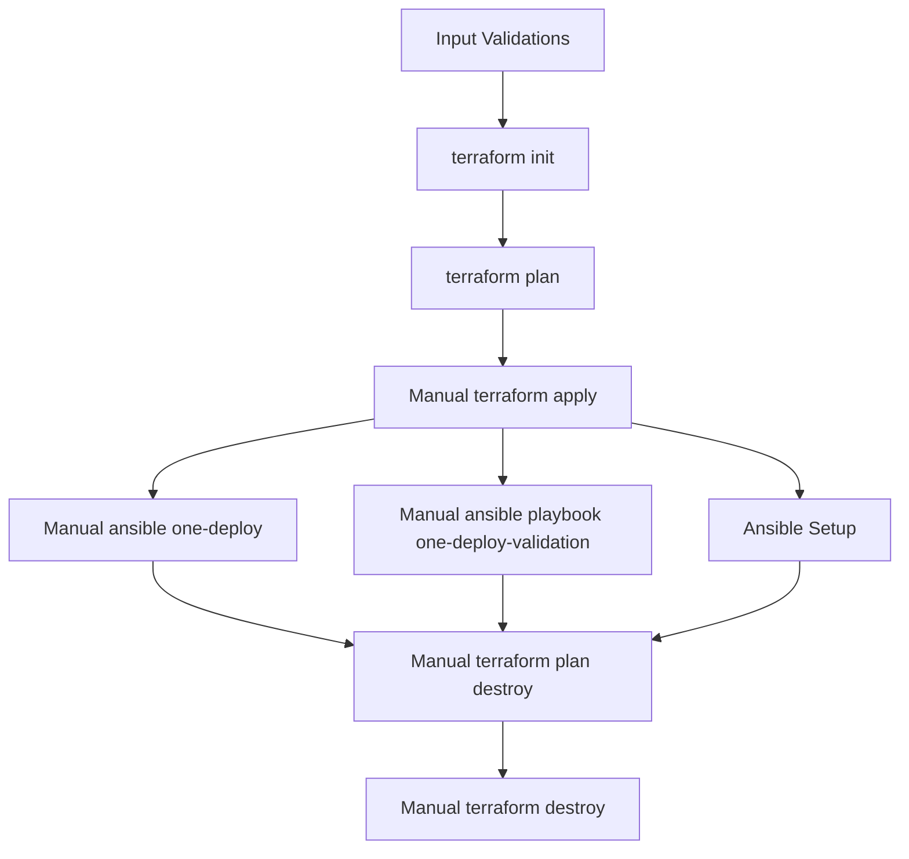

  

# Deployment Guide

## 🏗️ Target OpenNebula Architecture

This section provides a detailed description of the target architecture based on OpenNebula, specifically deployed on Scaleway Elastic Metal instances. The architecture is designed to leverage the robust capabilities of bare-metal servers to deliver a comprehensive Infrastructure-as-a-Service (IaaS) solution.

### Objectives

The primary objective is to deliver a full-fledged IaaS infrastructure on bare-metal servers, ensuring high performance, reliability, and scalability.

### Core Components

**OpenNebula Front-end (with KVM):**

- **Functionality:** Manages the entire lifecycle of virtual machines (VMs), including networking and storage. It also provides the OpenNebula frontend interface for user interaction.
- **Additional Role:** Runs local virtual machines, effectively acting as a compute node within the infrastructure.

**Hypervisor Nodes:**

- **Instance Type:** EM-A610R-NVMe instances running KVM.
- **Networking:** Connected to a private network for secure internal communication.
- **Public Access:** Can be attached to a Public IP to provide external access to VMs.

### Storage

- **Local Storage:** Each node is equipped with local NVMe SSDs to ensure high-speed data access and storage performance.
- **Capacity:** 2× NVMe 960 GB local storage per node, providing ample space for VM images and data.

### Networking

- **Virtual Network:** Utilizes Private Networks within a Virtual Private Cloud (VPC) to ensure secure and isolated communication between instances.
- **Public Gateway:** For high traffic scenarios, a Public Gateway is the preferred method. However, for initial deployment and Minimum Viable Product (MVP) phases, Public IPs can be directly attached to instances via Network Interface Cards (NIC).

### High-Level Diagram

The high-level diagram below illustrates the overall architecture, including the interaction between the OpenNebula Front-end, hypervisor nodes, and networking components.

### Hardware Specification

The hardware specifications for the Elastic Metal Instances – EM-A610R-NVMe are as follows:

| Role | Instance Type | CPU | RAM | Disks | KVM | Count | Bandwidth |
|------|---------------|-----|-----|-------|-----|-------|-----------|
| Front-end + KVM | EM-A610R-NVMe | AMD Ryzen PRO 3600 (6C / 12T) | 16 GB | 2× NVMe 960 GB | Yes | 1 | Up to 1 Gbps |
| Hypervisor(s) | EM-A610R-NVMe | AMD Ryzen PRO 3600 (6C / 12T) | 16 GB | 2× NVMe 960 GB | Yes | 1 to any | Up to 1 Gbps |

This setup ensures that the infrastructure is capable of handling a wide range of workloads, providing both the computational power and storage capacity necessary for demanding applications.

### Provisioning Strategies

#### Prerequisites and Capabilities

**Prerequisites:**
- Ubuntu 22.04 or 24.04 with Netplan version 0.105 or higher.
- Passwordless SSH login as root from the Front-end node to the Hypervisor nodes.
- The user performing the installation must have the ability to sudo to the root account.
- A range of free IP addresses available on the same network connecting the Front-end and Hypervisors.

**Capabilities:**
- Utilization of OneDeploy roles and tags.
- Integration of the OneHook driver in Ansible.

#### Initial Setup

Terraform is used to create instances and networks, and it generates inventories for Ansible.

#### Setting Up OpenNebula

For more details, refer to the [OpenNebula Documentation](https://docs.opennebula.io/7.0/software/installation_process/automatic_installation_with_onedeploy/).

Once the inventories are supplied, the setup can proceed using the `one-deploy-validation` and `one-deploy` submodules, which provide generic tasks to configure OpenNebula. This process relies on previously generated inventories and requires SSH and sudoers to be defined.

##### Runtime Hooks

Hooks must be provided to ensure runtime operations for OpenNebula. These hooks facilitate the hotplugging of public Network Interface Cards (NICs) using a driver specific to each cloud provider. For detailed specifications, refer to the [Hook Driver Documentation](https://docs.opennebula.io/7.0/product/integration_references/system_interfaces/hook_driver/).

In this particular case, the hook can be provided using an Ansible role for Scaleway. For more information, see the [Scaleway Guide](https://docs.ansible.com/ansible/latest/collections/community/general/docsite/guide_scaleway.html#ansible-collections-community-general-docsite-guide-scaleway).

##### Optional CI/CD

Given that sensitive tokens are often required to set up an environment, we can create a CI/CD pipeline where user inputs are defined as sensitive variables. This approach ensures secure handling of critical information. The CI/CD pipeline would prompt for the following sensitive inputs:

- Scaleway token (scw token)
- CIDR blocks
- Host IP addresses

The CI/CD pipeline can then validate these IP addresses against the provided CIDR blocks. This setup allows for a seamless and effortless environment configuration to deploy this module. Below are the steps involved in the CI/CD pipeline:

1. **Input Validations:** Ensure all provided inputs are valid and correctly formatted.
2. **Terraform Initialization:** Execute `terraform init` to initialize the Terraform configuration.
3. **Terraform Plan:** Run `terraform plan` to create an execution plan (this step depends on the successful completion of `terraform init`).
4. **Manual Terraform Apply:** Manually trigger `terraform apply` to apply the changes required to reach the desired state (this step depends on the successful completion of `terraform plan`).
5. **Ansible Setup:** Configure Ansible for deployment (this step depends on the successful completion of `terraform apply`).
6. **Manual Ansible Playbook Validation:** Manually trigger the Ansible playbook `one-deploy-validation` to validate the deployment (this step depends on the successful completion of `terraform apply`).
7. **Manual Ansible Deployment:** Manually trigger the Ansible playbook `one-deploy` to execute the deployment (this step depends on the successful completion of `terraform apply`).
8. **Manual Terraform Plan for Destroy:** Manually trigger `terraform plan -destroy` to create a plan to destroy the infrastructure (this step depends on the successful completion of `terraform apply`).
9. **Manual Terraform Destroy:** Manually trigger `terraform destroy` to destroy the infrastructure (this step depends on the successful completion of `terraform plan -destroy`).

Here is a simple Mermaid diagram illustrating the CI/CD steps:

This diagram provides a visual representation of the CI/CD pipeline steps and their dependencies.

